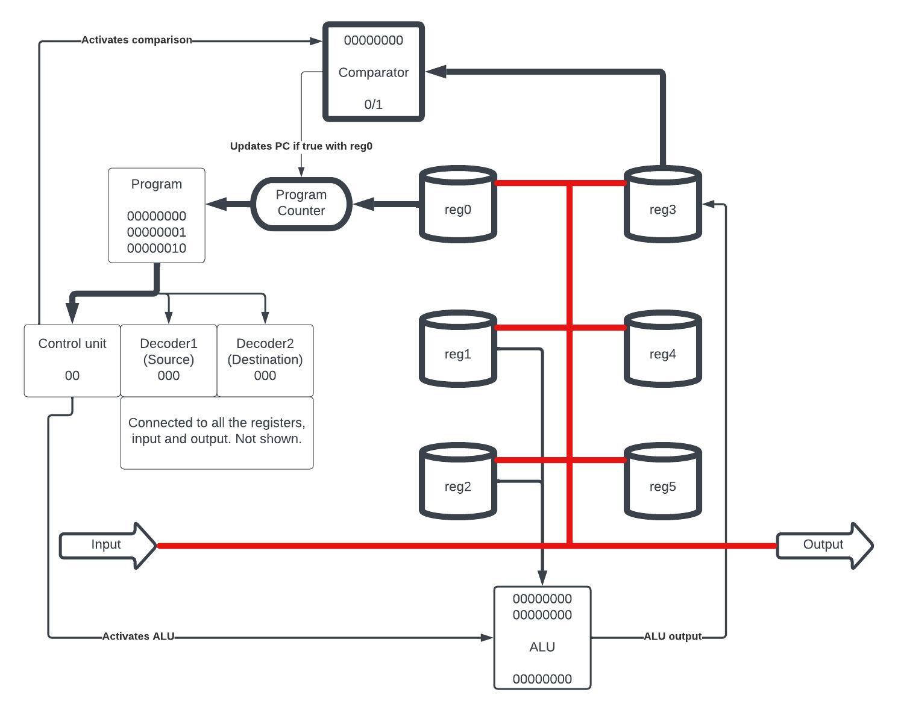
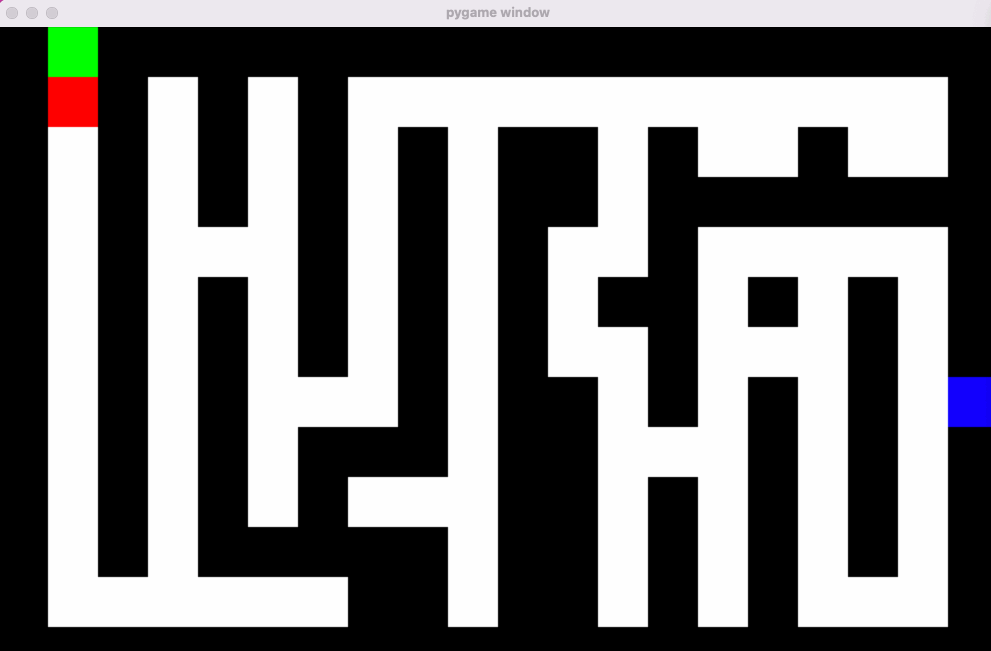

# 8 bit CPU emulator

This project emulates an 8 bit CPU using only logic gates and building upwards. All the operations are based on the underlying properties of the logic gates, and changing their operation leads to corresponding changes in function. More details about this project can be found [here](https://loreley.one/2023-07-cpu/)  
 
 
 
Usage  
```
pip install pygame
cd src/
python maze_run.py
```
This will run the program to navigate the robot out of the maze. The robot sees one square ahead, and is controlled by the `robot.asm` program.  
Can you solve the maze?  
You can also access the CPU directly from run.py to run a program of your choice.  

  

  
# Design

There are 6 registers, an input and an output. There is an ALU that can ADD, SUB, AND, OR. We can also perform comparisons.

#### Code
Move a value into reg0.
```
0  # move 0 into reg0   
36 # move 36 into reg0
```   
Note that the 2 MSB must always be false, so the max value is 63

Arithmetic  
The operands are always reg1 and reg2 and the output is stored in reg3.
```
add  
or
and
sub
```
Copy
```
copy 0 6 # copy from reg0 to output
copy 5 3 # copy from reg5 to reg3
```
Eval  
Evaluates reg3 against 0, if true sets the program counter to the value in reg0.
USES SIGNED NUMBERS
```
eval always
eval never
eval =
eval !=
eval < 
eval <=
eval >
eval >=
```  
Labels can be defined to be used as jumping points.    
```
label start
# read from input into reg1
copy 6 1
# add reg 1 and 2
add
#copy result into reg2
copy 3 2

# loop so long as we are not negative
start
eval >=

# if we overflow print result to output
copy 3 6

```
  
To write input and read output from the CPU pass it in as a callable.  
```
from hardware.cpu import CPU
from assembler import assemble_binary

program = assemble_binary('program.asm')

# funtions to be passed to the cpu
def write_to_input():
    return [0,0,0,0,0,0,0,1]
def read_from_output(value):
    if value != [0,0,0,0,0,0,0,0]: # CPU always returns 0 by default
        print('result:',value)

cpu = CPU(program)
cpu.run(write_to_input=write_to_input, read_from_output=read_from_output)
```

